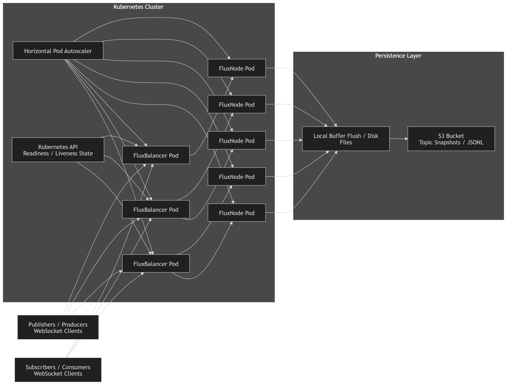
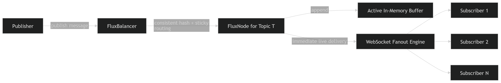

# Cluster Pub/Sub Relay - High-Throughput Pub/Sub Over WebSockets

Cluster Pub/Sub Relay is a **real-time, stateless, and horizontally scalable publish-subscribe system** built for event-driven applications. It leverages WebSockets and Kubernetes to deliver low-latency broadcasting at scale.

---

## Features

- **High Throughput**: Achieves 5000+ RPS under 100ms average latency in constrained environments.
- **Stateless Nodes**: All FluxNodes and FluxBalancers are completely stateless, enabling elastic scaling.
- **WebSocket-First**: Native push-based architecture, no polling required.
- **Dual Buffering**: Optimized for near-real-time streaming with best-effort consistency.
- **S3-based Persistence**: Message snapshots for recovery and offline delivery.

---

## Architecture

- `FluxBalancer`: Stateless load balancer with consistent hashing for sticky routing.
- `FluxNode`: Publishes messages to all subscribers of a topic via WebSocket fanout.
- `Locust`: Used for load generation and benchmarking.
- `K8s`: Horizontal scaling via HPA with optional resource constraints.



---
## How it works

Cluster Pub/Sub Relay is designed as a **real-time ephemeral streaming system** optimized for low-latency delivery rather than strict durability.

### 1. Topic Routing & Sticky Sessions

* Each topic is mapped to one or more `FluxNode` instances.
* `FluxBalancer` uses **consistent hashing** to route both publishers and subscribers to the same node for a given topic.
* This ensures **co-location of producers and consumers**, eliminating cross-node coordination during live message delivery.

---

### 2. Live Message Flow (Hot Path)

* Publishers send messages over WebSocket to the assigned `FluxNode`.
* The node immediately **fans out messages to all connected subscribers** of that topic.
* This path is fully in-memory and optimized for **minimal latency and high throughput**.
* Messages are delivered **only when both publisher and subscriber are actively connected** (no replay).



---

### 3. Buffering & Backpressure Handling

* Each topic maintains **multiple rotating in-memory buffers**.
* Incoming messages are written to the current active buffer.
* When a buffer reaches capacity, the writer moves to the next buffer **without blocking ingestion**.
* This prevents disk I/O and network latency (S3 uploads) from impacting the hot path.

---

### 4. Asynchronous Persistence (Cold Path)

* Filled buffers are handed off to background workers (goroutines).
* These workers:

  1. Flush buffer contents to local disk
  2. Upload data to S3 as immutable snapshots (JSONL format)
* Persistence is **fully decoupled from live delivery**, ensuring high throughput.


---

### 5. Failure Handling & Rerouting

* `FluxBalancer` uses **Kubernetes pod readiness/liveness signals** to identify healthy `FluxNode` instances.
* If a node fails:

  * Disconnected publishers/subscribers are **rerouted to another available node** serving the same topic.
  * Sticky routing is re-established dynamically.

> Note: Since the system does not support replay, reconnection restores **connectivity but not message continuity**.

---

### 6. Durability Tradeoff

* There exists a **bounded durability gap** between:

  * Message acceptance in memory
  * Successful persistence to S3
* If a node fails within this window, recent in-flight messages may be lost.

Cluster Pub/Sub Relay intentionally prioritizes:

* **low-latency real-time delivery**
* **high throughput under load**

over:

* strict durability guarantees
* replay-based recovery

---

### 7. System Model

Cluster Pub/Sub Relay follows an:

> **Ephemeral Stream + Asynchronous Durability** model

instead of a traditional:

> **Durable Log + Replay (e.g., Kafka)** model

This makes it well-suited for:

* live communication systems
* real-time dashboards
* multiplayer state sync
* collaborative presence systems

---
## Benchmark Highlights

- **Tested with 200 concurrent users, 10 Topics**
- **FluxNode and FluxBalancer Pod Count: 5**
- **Average Latency: 86.91ms**
- **95%ile Latency: 160ms**
- **99%ile Latency: 210ms**
- **RPS: 5974**
- **0% failure**

> Resource Constraints Used:
```yaml
resources:
  requests:
    cpu: "100m"
    memory: "128Mi"
  limits:
    cpu: "500m"
    memory: "256Mi"
```

## Project Structure
```
cluster-pubsub-relay/
├── flux_node/           # WebSocket subscriber management and fanout
├── flux_balancer/       # Custom load balancer with sticky routing
├── benchmark/           # Locust-based benchmarking suite
├── deployments/         # Kubernetes YAMLs (Deployments, Services, HPA)
└── README.md
```

## Deployment
### Dev Deployment

Start Minikube
```
minikube start
```

Create Secrets
```
kubectl create secret generic flux-secrets \
--from-literal=AWS_ACCESS_KEY_ID=<AWS_ACCESS_KEY> \
--from-literal=AWS_SECRET_ACCESS_KEY=<AWS_SECRET_ACCESS_KEY>
```

Start FluxBalancer
```
cd flux_balancer
skaffold dev
```

Start FluxNode
```
cd flux_node
skaffold dev
```

FluxBalancer will be made available using a Kubernetes Service, to access the URL, run the following command

```
minikube service flux-balancer --url
```
